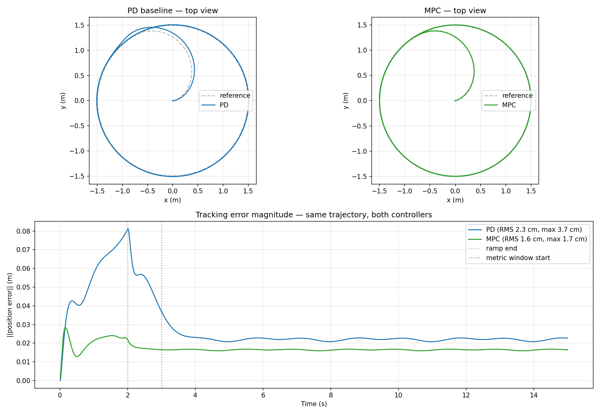

# uav-mpc-learning

UAV trajectory tracking with Model Predictive Control (MPC) and a learned residual model under model mismatch. The project implements a clean nonlinear MPC for a quadrotor (Skydio X2 in MuJoCo, via CasADi) and characterizes how a small learned residual closes the gap between the nominal MPC model and a perturbed plant.

## Results

**Simulation in Action:**


**MPC vs Classical PD Control:**



## Motivation

Nominal MPC assumes a perfect dynamics model. Real quadrotor systems exhibit model mismatch from payload variation, aerodynamic effects, motor lag, and sensing delay. This project measures, in a controlled simulator setting, how tracking performance degrades under five perturbation types and how much of that gap a small CPU-trainable residual model can recover. It also characterizes a regime in which the residual makes tracking actively worse, which is rarely reported in the literature.

## Approach

1. Implement a nominal nonlinear MPC for quadrotor trajectory tracking in MuJoCo, validated against a classical PD baseline.
2. Define five independent perturbation types: mass, inertia, drag, motor lag, and time delay.
3. Sweep each perturbation across its full stable range and characterize the degradation envelope of the nominal controller.
4. Train a small MLP residual model (5,641 parameters) on offline rollout data spanning 21 perturbation configurations.
5. Implement two integration architectures (in-constraint and feedforward) and evaluate the feedforward variant across the perturbation sweeps.

## Headline Findings

- The nominal MPC reduces RMS tracking error on the circle by 27 percent and maximum error by 54 percent relative to a tuned PD baseline.
- The residual model achieves validation R-squared above 0.97 on all three velocity components, trained in 29 seconds on a CPU-only laptop.
- The feedforward residual architecture recovers **80 to 92 percent** of tracking error under mass perturbations from 0.7 to 1.4 of nominal.
- The same architecture recovers **approximately zero percent** under drag perturbations because the single-channel correction cannot route the residual's horizontal-velocity information to where it is needed.
- The same architecture **increases tracking error by 15 to 45 percent** in the narrow transition zone of motor lag immediately before the cliff to closed-loop instability. This is a destabilization finding documented honestly rather than hidden.

## Project Structure

| Stage | Directory | Purpose |
|-------|-----------|---------|
| 1 | `stage1-uav-fundamentals/` | Theory notes on quadrotor dynamics, control hierarchy, MPC fundamentals |
| 2 | `stage2-mujoco-setup/` | MuJoCo and Skydio X2 setup, classical PD baseline controller |
| 3 | `stage3-mpc-baseline/` | Nominal nonlinear MPC implementation in CasADi with IPOPT |
| 4 | `stage4-perturbations/` | Perturbation harness and degradation characterization across five types |
| 5 | `stage5-learned-residual/` | Residual model training, CasADi conversion, and feedforward integration |
| 6 | `stage6-paper/` | Paper drafts, figures, and submission materials |

Auxiliary notes and references live in `notes/`.

## Reproduction

This project is designed to run on CPU only. No GPU required. Total reproduction time on a standard laptop is under 30 minutes.

**Tested on:** Ubuntu 22.04, Python 3.10.

**Setup:**

```bash
git clone https://github.com/Ashfak-Kausik/uav-mpc-learning.git
cd uav-mpc-learning
python3 -m venv .venv
source .venv/bin/activate
pip install -r requirements.txt
```

**Run the baseline (Stage 3):**

```bash
cd stage3-mpc-baseline
python3 scripts/05_mpc_mujoco_circle.py
python3 scripts/06_compare_pd_vs_mpc.py
```

**Characterize perturbations (Stage 4):**

```bash
cd ../stage4-perturbations
python3 scripts/02_sweep_mass.py
python3 scripts/04_sweep_drag.py
python3 scripts/05_sweep_motor_lag.py
python3 scripts/06_sweep_time_delay.py
python3 scripts/07_aggregate_results.py
```

**Train the residual and run the evaluation (Stage 5):**

```bash
cd ../stage5-learned-residual
python3 scripts/01_collect_data.py
python3 scripts/02_train_model.py
python3 scripts/05_sweep_mass_residual.py
python3 scripts/06_sweep_drag_residual.py
python3 scripts/07_sweep_lag_residual.py
python3 scripts/08_sweep_delay_residual.py
python3 scripts/09_aggregate_residual.py
```

Each stage directory contains its own README with detailed instructions, expected output, and discussion of the results.

## Hardware

Everything runs on CPU. No discrete GPU is required. The full pipeline (data collection plus training plus all evaluation sweeps) completes in under 30 minutes on a standard laptop.

## Paper

A conference paper based on this work is in submission. The paper writeup is in `stage6-paper/` along with the LaTeX source, bibliography, and figures.

## Status

Stages 1 through 6 complete. Active extensions: multi-axis residual correction, runtime closed-loop margin monitor, and hardware transfer planning.
